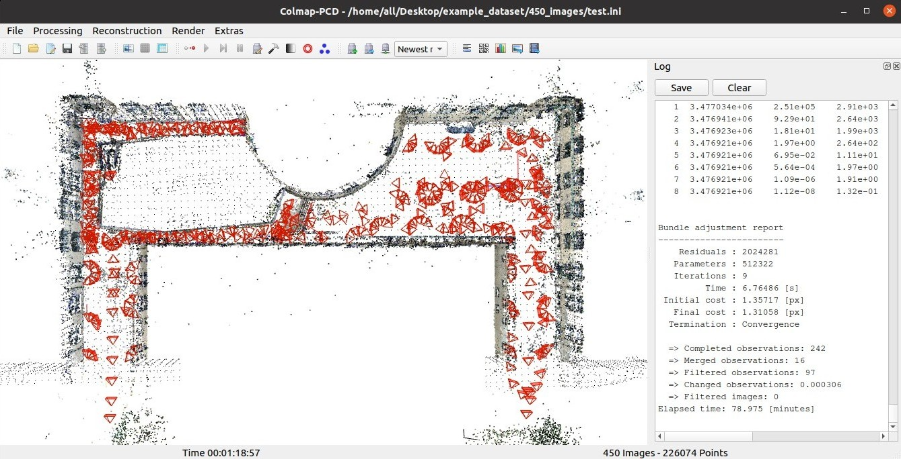
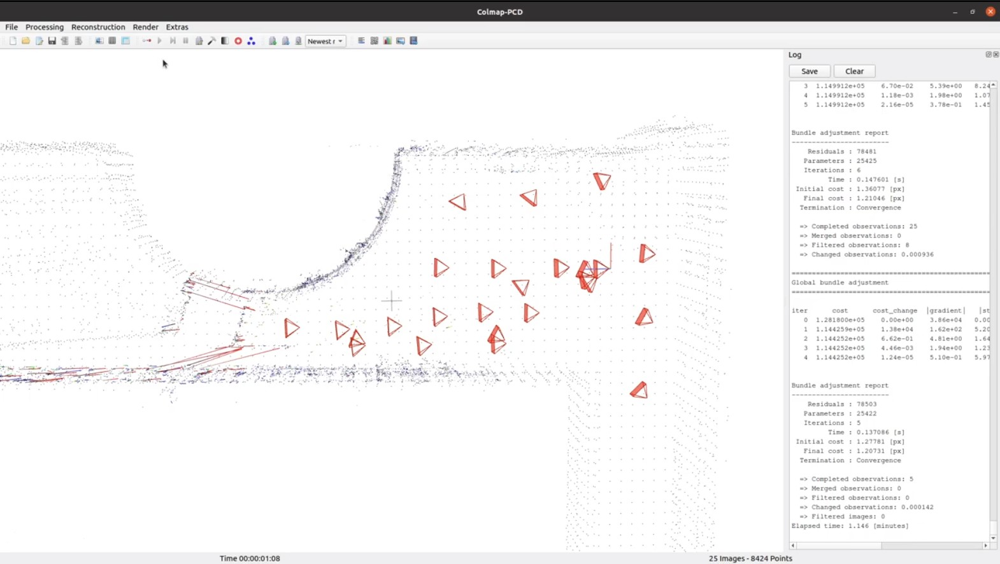
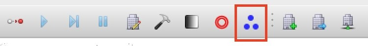
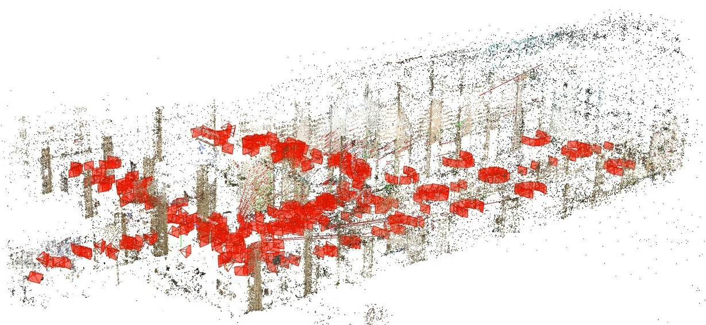
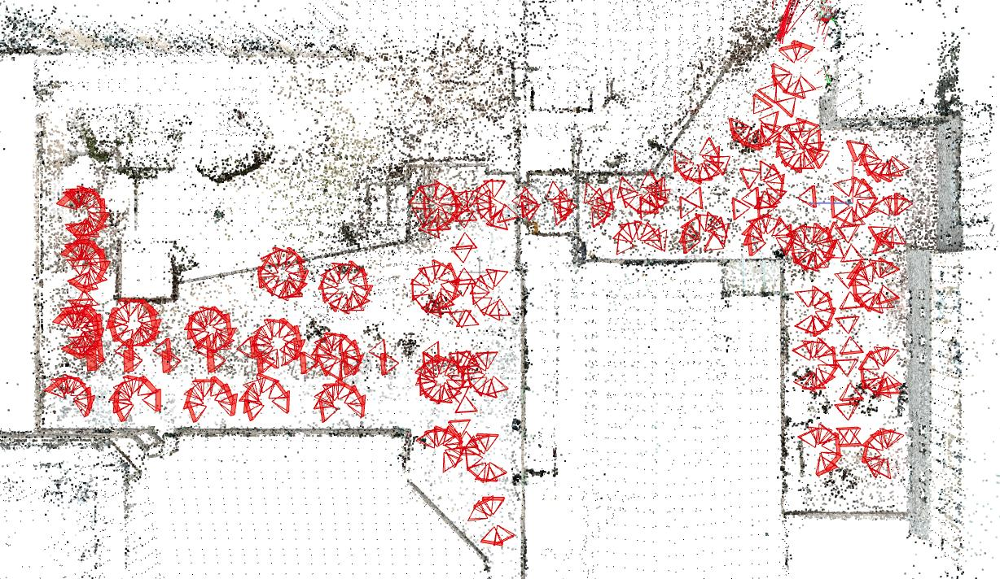
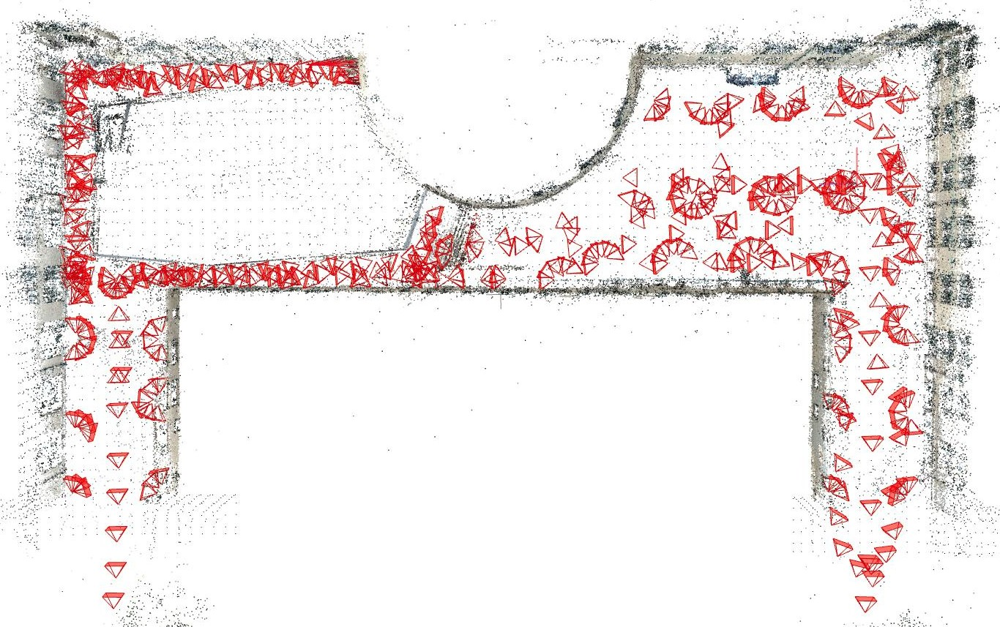

Colmap-PCD
==========

Colmap-PCD is an open-source tool for fine image-to-point cloud registration. The software extracts and matches features between pairwise images and from images to a point cloud. The matched features are formulated into constraints in a factor-graph optimization problem that solves for the camera poses together with the 3D reconstructed features. The initial image needs an approximately known camera pose for the processing to start. The repository is based on the original [Colmap](https://colmap.github.io) as imaged-based 3D reconstruction software.

The tool is developed as part of the [CMU-Recon System](https://www.cmu-reconstruction.com).

<p align="center">
  
</p>

## Prerequisite

The repository has been tested in Ubuntu 20.04 and Ubuntu 22.04. Install dependencies with the command line below.

```
sudo apt-get install \
    git \
    cmake \
    build-essential \
    libboost-program-options-dev \
    libboost-filesystem-dev \
    libboost-graph-dev \
    libboost-system-dev \
    libboost-test-dev \
    libeigen3-dev \
    libsuitesparse-dev \
    libfreeimage-dev \
    libmetis-dev \
    libgoogle-glog-dev \
    libgflags-dev \
    libglew-dev \
    qtbase5-dev \
    libqt5opengl5-dev \
    libcgal-dev \
    libcgal-qt5-dev \
    libatlas-base-dev \
    libsuitesparse-dev
```

Install the latest stable release of [Ceres Solver](http://ceres-solver.org) (click to download a 'ceres-solver-2.1.0.tar.gz' file). For computers with a Nvidia GPU, installing [CUDA](https://docs.nvidia.com/cuda) is highly recommended.

## Quick Start

Clone the open-source repository, compile, and install.

```
git clone https://github.com/XiaoBaiiiiii/colmap-pcd.git
cd colmap-pcd
mkdir build
cd build
cmake ..
make -j
sudo make install
```

Launch Colmap-PCD.

```
colmap gui
```

Download [Smith Hall Outdoor Dataset](https://drive.google.com/drive/folders/1P1J9cEWSSFCL_XmHSVYfuWgtmcgAWprB). We only need '25_images.zip', 'intrinsics.txt', and 'pointcloud_with_norm.ply' for quick testing, while we keep '450_images.zip' for full-scale testing later. After downloading, unzip '25_images.zip'. Then, [follow this instruction video](https://youtu.be/TuX8tCmJCC8) to load the example dataset to Colmap-PCD and start processing. The red lines illustrate the initial image-to-point cloud association. The blue and yellow lines illustrate the final associations for non-level and level surface points, respectively.

<p align="center">
  <a href="https://youtu.be/TuX8tCmJCC8"></a>
  <br /><a href="https://youtu.be/TuX8tCmJCC8">Instruction Video</a>
</p>

## Advanced

**Preparing point cloud**: We recommend using [CloudCompare](https://www.danielgm.net/cc) to prepare the point cloud. Downsample the point cloud to 3-5cm resolution, calculate normals using radius at 10-20cm, and save the point cloud in PLY format (binary or ASCII). Make sure the coordinate convention of the point cloud is x-front, y-left, and z-up. Users can also view the 'pointcloud_with_norm.ply' file from [Smith Hall Outdoor Dataset](https://drive.google.com/drive/folders/1P1J9cEWSSFCL_XmHSVYfuWgtmcgAWprB) in CloudCompare.

**Setting initial camera pose**: The default camera pose of the initial image is set to the point cloud origin without rotation (camera is level and looking toward x-axis). If users record the initial image elsewhere and need to set the initial camera pose, click 'Reconstruction->Reconstruction options', in the 'Init' tab, set 'init_image_x [m]', 'init_image_y [m]', 'init_image_z [m]', 'init_image_roll [deg]', 'init_image_pitch [deg]', and 'init_image_yaw [deg]'. Note that the camera pose follows the same coordinate convention with the point cloud, x-front, y-left, z-up, which is different from typical camera coordinate conventions.

**Saving camera poses**: After processing completes, click 'Reconstruction->Reconstruction options', in the 'Lidar' tab, set 'save_image_pose_folder'. Then, click the button in the figure below to save a 'pose.ply' file. Users can exame the camera poses in the file with a text editor. Note that the camera poses follow the same coordinate convention with the point cloud, x-front, y-left, and z-up, which is different from typical camera coordinate conventions.

<p align="center">
  
</p>

**Loading camera pose priors**: Before processing starts, click 'Reconstruction->Reconstruction options', in the 'Lidar' tab, check 'if_import_image_pose_prior' and set 'image_pose_prior_path'. The path should point to a file containing camera poses in the same format as the 'pose.ply' file mentioned above. The processing will use the camera poses in the loaded file as priors to seed the factor-graph optimization.

**Tunning parameters**: Click 'Reconstruction->Reconstruction options', in the 'Lidar' tab, 'depth_proj_constraint_weight' defines the weight of the image-to-point cloud constraints in initial association, 'icp_nonground_constraint_weight' and 'icp_ground_constraint_weight' define the weights in final associations for non-level and level surface points, respectively, 'min_depth_proj_dist' and 'max_depth_proj_dist' define the minimum and maximum distances w.r.t. the camera for initial association, 'kdtree_max_search_dist' and 'kdtree_min_search_dist' define the start and end distance thresholds between reconstructed features to the point cloud in final associations, and 'kdtree_search_dist_drop' defines the distance threshold dropping interval.

**Refining registration**: After processing completes, users can optionally choose to refine the registration in a batch optimization. Click 'Reconstruction->Bundle adjustment' followed by the 'Run' button. Users can optionally refine the camera intrinsics together by checking 'refine_focal_length', 'refine_prinpical_point', and 'refine_extra_params'.

## Datasets

[NSH Atrium Indoor Dataset](https://drive.google.com/drive/folders/1Dmpv91aFBUZfIa1Sh23T0a_Z4PKvsfHN): Registration of 450 images in the figure below.

<p align="center">
  
</p>

[NSH Patio Outdoor Dataset](https://drive.google.com/drive/folders/1mUs4eRK1aGXgNui4wRt0KaLBX7qXGD-q): Registration of 450 images in the figure below. To improve initialization robustness, click 'Reconstruction->Reconstruction options', in the 'Init' tab, set 'init_image_id2 = 2'.

<p align="center">
  
</p>

[Smith Hall Outdoor Dataset](https://drive.google.com/drive/folders/1P1J9cEWSSFCL_XmHSVYfuWgtmcgAWprB): Registration of 25 images in the [instruction video](https://youtu.be/TuX8tCmJCC8), and registration of 450 images in the figure below.

<p align="center">
  
</p>

## License

The repository is licensed under BSD license.

## Authors
[Chunge Bai](https://github.com/XiaoBaiiiiii), [Ruijie Fu](https://ruijiefu.com), and [Ji Zhang](https://frc.ri.cmu.edu/~zhangji)

## Credits

This repository is based on the original [Colmap](https://colmap.github.io).


